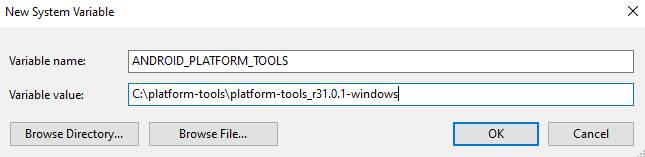

# README

## Table of Contents

- ADB for Android (Windows)
- Reference
  - CMTracker

 

 

## ADB for Android (Windows)

    
    
Environment Variables | System variables

 

 

## Reference

### CMTracker Project

> https://github.com/deluser8/cmtracker

CMTracker began as a research project at the Fudan University, with the goal of understanding cryptojacking webpages in the wild.

Our corresponding paper was accepted by ACM CCS 2018:

How You Get Shot in the Back: A Systematical Study about Cryptojacking in the Real World. Geng Hong, Zhemin Yang, Sen Yang, Lei Zhang, Yuhong Nan, Zhibo Zhang, Min Yang, Yuan Zhang, Zhiyun Qian, Haixin Duan. In Proceedings of the 25th ACM Conference on Computer and Communications Security, CCS'18, Toronto, Canada, October 15-19, 2018 (to appear). [pdf](https://yangzhemin.github.io/papers/cmtracker-ccs2018.pdf)

We thank the many contributors to this project and our paper, including Zhiyun Qian in uc riverside, Haixin Duan in Tsinghua University, and other collaborators.

We welcome any question about this project, please contact Geng Hong or [Zhemin Yang](https://yangzhemin.github.io/)

Edited by Zhemin Yang, Sep 21, 2018

 

#### (2018) How You Get Shot in the Back: A Systematical Study about Cryptojacking in the Real World - CCS'18

> https://dl.acm.org/doi/10.1145/3243734.3243840

##### Abstract

&nbsp;&nbsp;As a new mechanism to monetize web content, cryptocurrency mining is becoming increasingly popular. The idea is simple: a webpage delivers extra workload (JavaScript) that consumes computational resources on the client machine to solve cryptographic puzzles, typically without notifying users or having explicit user consent. This new mechanism, often heavily abused and thus considered a threat termed "cryptojacking", is estimated to affect over 10 million web users every month; however, only a few anecdotal reports exist so far and little is known about its severeness, infrastructure, and technical characteristics behind the scene. This is likely due to the lack of effective approaches to detect cryptojacking at a large-scale (e.g., VirusTotal). In this paper, we take a first step towards an in-depth study over cryptojacking. By leveraging a set of inherent characteristics of cryptojacking scripts, we build CMTracker, a behavior-based detector with two runtime profilers for automatically tracking Cryptocurrency Mining scripts and their related domains. Surprisingly, our approach successfully discovered 2,770 unique cryptojacking samples from 853,936 popular web pages, including 868 among top 100K in Alexa list. Leveraging these samples, we gain a more comprehensive picture of the cryptojacking attacks, including their impact, distribution mechanisms, obfuscation, and attempts to evade detection. For instance, a diverse set of organizations benefit from cryptojacking based on the unique wallet ids. In addition, to stay under the radar, they frequently update their attack domains (fastflux) on the order of days. Many attackers also apply evasion techniques, including limiting the CPU usage, obfuscating the code, etc.

 

##### Abstract

&nbsp;&nbsp;웹 콘텐츠로 수익을 창출하는 새로운 메커니즘으로 암호화폐 채굴이 점점 인기를 얻고 있다. 아이디어는 간단하다: 웹 페이지는 일반적으로 사용자에게 알리거나 명시적인 사용자 동의없이 암호화 퍼들들을 해결하기 위해 클라이언트 컴퓨터의 계산 리소스를 사용하는 추가 워크로드(JavaScript)를 제공한다. 종종 심하게 악용되어 "크립토재킹(Cryptojacking)"이라 불리는 위협으로 간주되는 이 새로운 메커니즘은 매달 1천만 명 이상의 웹 사용자에게 영향을 미칠 것으로 추정되지만, 현재까지 일부 보고서만 존재하며 그 심각성, 기반구조 및 이면의 기술적 특성에 대해서는 거의 알려져 있지 않다. 이는 대규모(예: VirusTotal)에서 암호화 재킹을 탐지하는 효과적인 접근 방식의 부족 때문일 수 있다.

&nbsp;&nbsp;이 논문에서는 크립토재킹에 대한 심층 연구를 위한 첫 번째 단계를 밟는다. 크립토재킹 스크립트의 고유한 특성을 활용하여 Cryptocurrency Mining 스크립트 및 관련 도메인을 자동으로 추적하는 두 개의 런타임 프로파일러가있는 행위기반 탐지기인 CMTracker를 구축했다. 여기서의 접근 방식은 Alexa 목록의 상위 10 만 개 중 868 개를 포함하여 853,936 개의 인기 웹 페이지에서 2,770개의 고유 한 크립토 재킹 샘플을 성공적으로 발견했다. 이러한 샘플을 활용하여 크립토재킹 공격 영향, 배포 메커니즘, 난독화 및 탐지 회피 시도를 포함하여 보다 포괄적인 구조를 파악한다. 예를 들어, 다양한 조직들은 고유한 지갑 ID를 기반으로 하는 크립토재킹으로 이익을 취한다. 또한 레이더 아래에 머물기 위해 며칠 단위로 공격 도메인 (fastflux)을 자주 업데이트한다. 많은 공격자들은 CPU 사용량 제한, 코드 난독화 등의 회피 기술도 적용한다.

 

-----